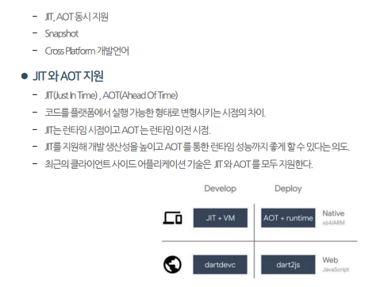

# Dart

#### 목차
0 [Dart 개요](#0-dart-개요)  
1 [Dart 특징 - 1](#1-dart-특징---1)  
2 [Dart 특징 - 2](#2-dart-특징---2)  
3 [변수](#3-변수)  
4 [상수 - final vs const](#4-상수---final-vs-const)  
5 [연산자](#5-연산자)  
&nbsp;&nbsp;5.1 [널 인지 연산자](#51-널-인지-연산자)  
&nbsp;&nbsp;&nbsp;&nbsp;5.1.1 [5.1.1 ?. 연산자](#511--연산자)  
&nbsp;&nbsp;&nbsp;&nbsp;5.1.2 [5.1.2 ?? 연산자](#512--연산자)  
&nbsp;&nbsp;&nbsp;&nbsp;5.1.3 [5.1.3 ??= 연산자](#513--연산자)  
&nbsp;&nbsp;&nbsp;&nbsp;5.1.4 [5.1.4 기타 연산자](#514-기타-연산자)  
6 [데이터 타입](#6-데이터-타입)  
7 [함수](#7-함수)  
8 [클래스](#8-클래스)  
9 [상속, 인터페이스](#9-상속-인터페이스)  
10 [Mixin](#10-mixin)  
11 [null safety](#11-null-safety)  


## 0 Dart 개요
- Dart는 2011년 Google이 개발한 Front-End Software Language.
- 처음에는 javascript를 대체할 언어로 개발

- Javascript 를 대체할 언어일 CoffeeScript, TypeScript가 이미 존재
- JQuery 가 대세인 상황에서 필요성을 느끼지 못함
- 2018년 배우지 않아도 되는 소프트웨어 언어 1위

- Mobile Cross Platform 개발 프레임워크인 Flutter 에서 개발 언어로 Dart를 채택하면서 인기 급 상승
- 2019년 Google IO 에서 Fuchsia OS 의 개발 프레임워크로 Flutter 채택
- Dart의 주 목적인 Front-End Software 개발 언어로서 주목 받기 시작


## 1 Dart 특징 - 1
1. 객체지향 언어이며 단일 상속을 지원
2. 다트는 모든 것이 객체이며 모든 객체는 클래스의 인스턴스, 모든 객체는 Object 클래스를 상속받음
3. **형식을 갖는 프로그래밍 언어**
    - **자바스크립트, 파이썬 등은 런타임에서 형식을 추론하는 동적 언어**
    - **다트는 형식을 미리 지정해주는 언어**
4. 최상위 수준 함수와 변수를 지원 - 라이브러리 멤버
5. 어휘적으로 한정
   
## 2 Dart 특징 - 2

```dart
dynamic myNumger = 'aa';
var a = 'gkgkgkgk'; // 이후 1을 대입하면 에러, 변수의 형식을 지정 시 바꿀 수 없음
```
**var** : 타입 유추, 변수형 상관없이 사용할 수는 있으나 한번 지정 시 변경 불가, 초기 값 대입하지 않을 시 dynamic 타입 지정

**dynamic** : 타입이 아니라 유추(타입이 없음), 변수 타입 변경 가능

Map\<dynamic\> 같이 여러 용도로 사용 가능  
var는 변수 선언 시에만 사용

## 3 변수
- int, double 타입 등의 변수도 모두 객체, 자동 형변환을 제공하지 않음

```dart
int c = b.toInt();
```

## 4 상수 - final vs const
최초 선언 시 어떠한 변수형으로도 사용이 가능하지만 선언 이후엔 값조차 변경할 수 없음

**const** : complie-time 상수 -> 생성자로 초기화 불가능

**final** : rumtime 상수 -> 생성자로 초기화 가능

\=\=\=\= 선언 \=\=\=\=  
**final**은 top-level, class member, local variable 에서 선언 가능  
**const**는 top, local variable에서 선언 가능, class memeber에서는 static에만 가능

```dart
const foo = 567; // ok
final boo = 123; // ok

// final 변수에 변수로 값을 넣는 경우
var boo = 567;
final foo = foo; // ok

// const 변수에 변수로 값을 넣는 경우
var boo 567;
const foo = boo; // 에러

// 현재 시간을 const와 final에 넣는 경우
const foo = DateTime.now(); // 에러
final boo = DateTime.now(); // ok

class Test {
    final int a = 10;
    const int a = 10; // 에러
    static const int b = 20;

    static const int data1; // 에러
    Test(this.data1); // 에러
}
```

## 5 연산자

### 5.1 널 인지 연산자
#### 5.1.1 ?. 연산자

```dart
this.userAge = user?.age
// user가 null이 아니면 age값을 userAge에 할당
// user가 null이면 오류 발생하지 않고 userAge에 null을 할당
```

#### 5.1.2 ?? 연산자

```dart
this.userAge = user.age ?? 18 // null이면 18을 입력
```

#### 5.1.3 ??= 연산자

```dart
int x = 5;
aa == null;
x ??= aa; // x = 5 유지
// 피 연산자 값이 null 이면 대입이 발생하지 않음, 이전 값 유지
```

#### 5.1.4 기타 연산자

```dart
// 나누기 연산자
// ~/ : 나눈 값의 결과가 정수

if(obj is user)....

Obejct ob = User();
(ob as User).some();... // 타입 user
```

## 6 데이터 타입
- 스트링 비교 : == 으로 비교 가능

## 7 함수
- function 타입: 함수가 변수에 대입 가능, 람다식 지원

```dart
int some(int no) {
    return no + 10;
}

int some1(int no) {
    return no * 10;
}

Function data1 = some;

Function testFunc(var argFun) {
    return some1;
}

void main() {
    print(data1(10)); // 20
    var result = testFunc(some(10));
    print(result(10)); // 100
}
```

- optional
    - 대입하지 않아도 되는 매개 변수
    - optional named, optional unnamed
    - 하나의 함수 내에서 한번만 가능
    - 맨 마지막 매개변수만 optional으로 만들 수 있음
    - named와 unnamed를 같이 사용할 수 없음

```dart
some({int no1, int no2}) {
    ...
}

some(no1: 10, no2: 20);

some({int no1 = 10}) { // default 값 명시 가능
    ...
}

void some([String name, int age]) {} // unnamed

some('hello');
```

## 8 클래스
- new 키워드를 권장하지 않음
  - 예시: Cat a = Cat();
- 생성자
  - 예시: AA({this.a = 10, this.b = "aaaa"}) {};
- Named Constructor: 이름있는 생성자

```dart
class User {
    int a;
    User.one() {
        a = 30;
    }
}

// 객체 사용
void main() {
    User user = User.one();
}

// 생성자 오른쪽 영역에 : 로 초기화 가능
User(String a) : this.a = a { }
```

- factory Constructor: **factory** 예약어
  - 생성자임에도 자동으로 객체가 생성되지 않음
  - 상황에 맞게 리턴해주어야 함

```dart
// factory Constructor: factory 예약어
// 생성자임에도 자동으로 객체가 생성되지 않음
class Test {
    factory Test() {}
}

var ob = Test(); // 생성되지 않음
// ob == null
```

- class 객체 타입 찾기: **runtimeType** 예약어

```dart
Object obf1 = 10.0;
print(obf1.runtimeType); // double
```

## 9 상속, 인터페이스 등
- 추상 클래스 지원: abstract class A
- interface 예약어는 없으나, implements로 구현 시 interface로 사용 가능
- 하나의 클래스에서 여러 인터페이스를 구현할 수 있음

## 10 Mixin
- 클래스의 중복을 피하는 방법
- 공통 코드(변수, 함수)를 믹스인에 작성하고 필요한 클래스에서 믹스인을 적용하면 해당 클래스에서 작성된 것처럼 사용
- 맥스인은 클래스가 아니며, 생성자를 가지지 못하고, 객체 생성 안됨
- with 예약어로 이용
- 하나의 클래스에서 여러 믹스인을 사용할 수 있음
- on 키워드 이용 시 특정 클래스 형식만 믹스인 되도록 정의 가능

```dart
mixin MyMixin {
    String data;
    void some() {
        print('I am mixin some()... $data');
    }
}

class MyClass with MyMixin {

}

void main() {
    var obj = MyClass();
    obj.data = 'hello';
    obj.some();
}

mixin A on Super {
    ...
}

class Sub extends Super with A {

}
```

## 11 null safety
- Null Exception 이 발생하지 않도록 하기 위해 도입
- 런타임에서 발생할 에러를 컴파일 단계에서 처리할 수 있어 실수를 줄임

```dart
class Test {
    String a; // 기본 not null
    String? aa; // null 가능

    Test(this.a); // not null은 초기화 해주어야 함

    void test() {
        aa.length; // 에러, null일 수 있음
        aa!.length; // aa 는 반드시 널이 아니다라고 선언 -> null이 들어오면 런타임 에러
        aa ?? "".length; // aa가 널일 경우 ""을 넣는 처리를 강제할 수 있음
    }

}
```

