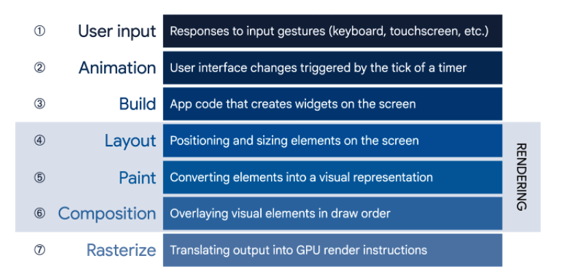
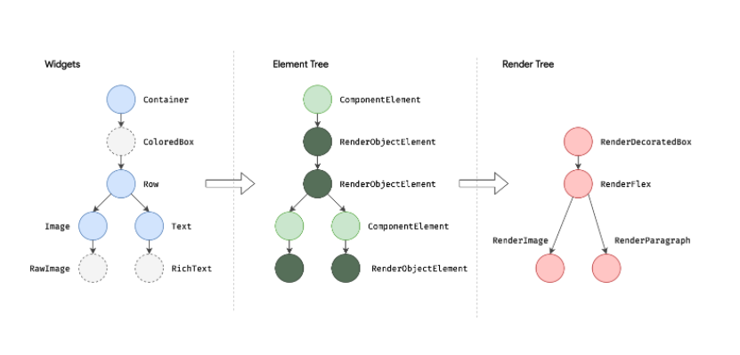
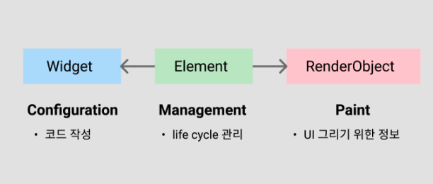
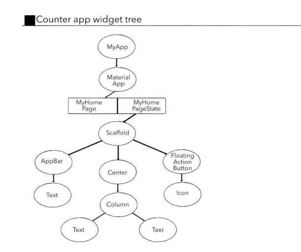

# 위젯

## 0. Dart API :

- [https://api.flutter.dev/](https://api.flutter.dev/)

## 1. Widget 이란

- 플러터에서 뷰를 묘사하는 다트 클래스.  특정 UI를 정의하는 클래스
- 플러터가 이해할 수 있는 뷰 모델.
- 웹 등 다른 프레임워크에서는 위젯을 **컴포넌트**라 부름
- 핵심 : **모든 UI가 Widget이다.**
- build 메서드를 갖는다. (StatefulWidget은 포함하지 않음)

## 2. 상속 관계

```dart
Object ->  DiagnosticableTree -> Widget
 -> PreferredSizeWidget,ProxyWidget,RenderObjectWidget,StatefulWidget,StatelessWidget
```

 ****

## 3. 클래스 보기

- Object Class : 최상위 클래스. 할말 없음
- **DiagnosticableTree Class**
    - **Diagnosticable : 진단가능한**
    - 플러터 UI를 개발한다는 것은 수많은 위젯을 조합해 위젯 트리를 완성함을 의미함. 해당 클래스를 상속받음으로써 위젯 트리 구성 가능한 기능을 구현
    - **개체의 속성과 자식을 설명하는 문자열 및 DiagnosticsNode 디버그 표현을 제공하기 위한 기본 클래스입니다. (구글 번역 ㅋ)**
- Widget Class
    - static bool canUpdate
    - Element createElement();   // element tree구성에 필요한 element 생성
- StatelessWidget
    - Widget build(BuildContext context);
    - StatelessElement createElement() => StatelessElement(this);
- StatefulWidget  : build 대신 상태 클래스 포함 → State는 build
    - State createState();
    - StatefulElement createElement() => StatefulElement(this);
- State<T extends StatefulWidget> with Diagnosticable
    - BuildContext get context
    - void initState()
    - void dispose() {
    - void didUpdateWidget
    - void setState(VoidCallback fn) {
    - ...
    - **Widget build(BuildContext context);**

## 4. 위젯 렌더링

[플러터는 초당 60프레임을 보여준다. 초당 최대 60번 화면이 바뀐다는 뜻이다. 120fps까지 지원하는 기기에서는 초당 120프레임까지 보장한다.](https://docs.flutter.dev/perf/rendering/ui-performance) 이런 성능을 내려면 당연히 특별한 렌더링 방법이 있을 것이다. 플러터는 렌더링 성능을 내기 위해 트리 3개를 사용한다.

전체 단계는 이렇다. [아래 그림은 유저의 행동부터 GPU에게 컨트롤이 넘어갈 때까지, high - low 순서대로 어떤 일이 일어나는지 순서대로 나타낸 것이다.](https://docs.flutter.dev/resources/architectural-overview#from-user-input-to-the-gpu)



플러터는 build 단계에서 위젯 트리(widget tree)와 엘리먼트 트리(element tree)를 만들고, layout 단계에서 렌더 트리(render tree)를 만든 다음 paint 단계에서 가장 마지막에 만든 렌더 트리를 써먹는다.

# <<< BUILD 단계 >>>

## 5. build 함수의 실행 결과는 widget tree



세개의 트리가 만들어짐. 

- 위젯 트리 : 만들고자 하는 모양을 설계한 설명서.
- 엘리먼트 트리 : 설명서를 보고 실제로 그려질  instance를 만들어놓은것.  : **실제 lifeCycle 관리**
- 렌더 트리 : 실제로 화면을 그릴 노드 (엘리먼트트리의 RenderObejectElement). 반드시 필요한 내용만 담는다.



- StatefulWidget 위젯트리 예시



## 6. 위젯은 immutable, 엘리먼트, RenderObject는 mutable

- 플러터의 모든 위젯은 immutable하다. 즉, 런타임 도중에 내용을 수정할 수 없다. 만약 이미 렌더링된 위젯을 다른 모습으로 바꾸고 싶다면 플러터는 위젯 트리에서 그 위젯에 해당하는 노드를 삭제하고, 새로운 위젯 노드를 끼워넣는다.

- 이렇게 위젯이 교체되면 플러터는 2가지 행동을 할 수 있다.

1. 오래된 주문서(이전 위젯)로 만들었던 렌더 오브젝트의 내용을 새 주문서(새 위젯) 내용에 맞게 고치기

2. 오래된 주문서로 만들었던 렌더 오브젝트를 버리고, 같은 위치에 새 주문서로 만든 새 렌더 오브젝트 끼워넣기

**바꾸는 작업은 위젯과 렌더 오브젝트 중간에 있는 엘리먼트가 수행한다**. 엘리먼트가 위젯이 완전히 다른 위젯으로 변하지 않고 일부 내용만 바뀌었다는 사실을 감지하면, `updateRenderObject` 메소드를 호출해서 렌더 오브젝트의 내용을 바꾼다. **렌더 오브젝트는 mutable하기 때문에 런타임 도중에 수정할 수 있다.**

플러터는 기존 위젯이 "완전히 다른 위젯으로 바뀌지 않았"다는 사실을 알아내는 기능 :  `Widget.canUpdate` 함수가 이를 알려준다.

```
static bool canUpdate(Widget oldWidget, Widget newWidget) {
  return oldWidget.runtimeType == newWidget.runtimeType
    && oldWidget.key == newWidget.key;
  }
```

즉, 기존 위젯의 runtimeType이 새 위젯과 다르거나 기존 위젯의 key가 새 위젯과 다르면 플러터는 해당 위젯이 완전히 다른 위젯으로 바뀌었다고 판단한다. 만약 이렇게 완전히 다른 위젯으로 바뀌었다면, 기존 렌더 오브젝트 자체를 삭제하고 다시 새로운 렌더 오브젝트를 만든다.

## **요약 : 중간에 위젯이 바뀌어도 렌더 트리는 최소한의 변경을 하도록 설계되어있어 성능에 유리함**

# <<< 레이아웃 단계 >>>

## 8. 레이아웃 단계

1. **Constraints go down.**  : 제한조건을 자식으로 내려보냄 (ex: 가로가 100까지 가능하니 아래는 알아서해)
2. **Sizes go up.** : child는 자신이 받았던 제한 조건을 만족하는 범위 내에서 자신의 정확한 크기를 결정하고, 이를 parent에게 알려준다 (ex: 그럼 내 가로 사이즈는 99로 할래요)
3. **Parent sets position.** : 자신의 child로부터 크기를 받은 parent 노드는, 이제 각 child가 정확히 어디에 위치할지 정할 수 있다.

# 요약 : DFS 방식의 알고리즘으로 레이아웃 성능이 우수함

단점 : 

- 위젯은 parent에 의해 주어진 제약 조건 내에서만 자체 크기를 결정할 수 있다. 즉, 위젯이 항상 자신이 원하는 크기를 가질 수 있는건 아니다.
- 자신의 parent가 위젯의 위치를 결정하기 때문에 위젯은 화면에서 자신의 위치를 알 수도 없고 결정할 수도 없다.
- parent의 크기와 위치도 parent의 parent에 따라 달라지기 때문에 트리 전체를 고려하지 않고 위젯의 크기와 위치를 정확하게 정의할 수 없다.
- child가 parent와 다른 크기를 원하는 경우, parent가 이를 정렬할 수 있는 충분한 정보를 가지고 있지 않으면 child의 크기가 무시될 수 있다.

## 9.  플러터가 위젯을 렌더링하는 순서

1. 위젯 트리 만들기: build 함수를 마구 호출한다.
2. 엘리먼트 트리 만들기: 위젯 트리를 보고 만든다.
3. 렌더 트리 만들기: 엘리먼트 트리를 보고 만든다.
4. 레이아웃 작업: 1 프레임마다 렌더 트리를 DFS(깊이우선 탐색 알고리즘)로 1번 훑는다.

## 10. 위젯에 항상 등장하는 context

모든 위젯은 `widget.buildContext`
를 통해 자신과 연결된 엘리먼트에 접근할 수 있다. buildContext 안에는 자신이 위젯 트리에서 어떤 노드에 위치하는지 알려주는 정보가 있기 때문이다.

생각해보면 다이얼로그를 띄운다는건 현재 렌더링 된 화면 위에 다이얼로그의 배경과 다이얼로그 UI를 추가로 그린다는 뜻이다. 그렇다면 '현재 렌더링 된 화면'이 트리에서 어디에 위치하는지 알아내야 한다.

## 11. 엘리먼트 트리가 엘리먼트를 교체하기 위해 위젯트리에 검증하는 정보

- 위젯에 변경이 생겼다면 엘리먼트트리에서는 교체 필요여부를 체크한다.
- 확인하는 정보
    - **런타임의 정확한 객체 타입 체크**
    - **(키가 있다면) 위젯의 키**
- 만약 키를 설정해둔 뒤에 같은 타입의 A button, B button이 생성된 이후에 해당 버튼의 순서를 바꾸면 엘리먼트 트리에서는 **같은 타입의 객체이고 키가 없으므로 해당 정보에 대해서 업데이트를 하지 않는다!**
- 위와 같은 상황을 해결하기 위해 위젯 키를 설정한다.
    - 글로벌 키 : 성능에 영향을 미치므로 권장하지 않음
    - 로컬 키 : ValueKey<T> (상수를 갖는 객체에 키를 추가할때), ObejctKey(프로퍼티값이 다른 여러 객체가 있을때), UniqueKey, PageStorageKey(페이지 정보 저장 키)

## 12. setState()

- 호출시 _A.build 메서드를 실행하면서 설정이 바뀐 모든 위젯을 다시 그리는 역할
- 주의사항 : 실행전 비동기 코드를 완료해야함. 위젯을 그릴때 필요한 데이터가 준비되어 있어야하기 때문

## 13. 요약

- 플러터의 모든 것은 위젯. 위젯은 뷰를 묘사하는 다트 클래스이다.
- 모든 위젯은 위젯을 반환하는 build 메서드를 포함해야한다.(stateful 제외)
- 플러터에서 위젯은 변경할 수 없지만 상태 객체는 바꿀 수 있다.
- StatefulWidget은 상태 객체로 자신의 내부 상태를 관리한다.
- StatelessWidget은 플러터가 위젯 트리에서 위젯을 제거하면 완전히 파괴된다.