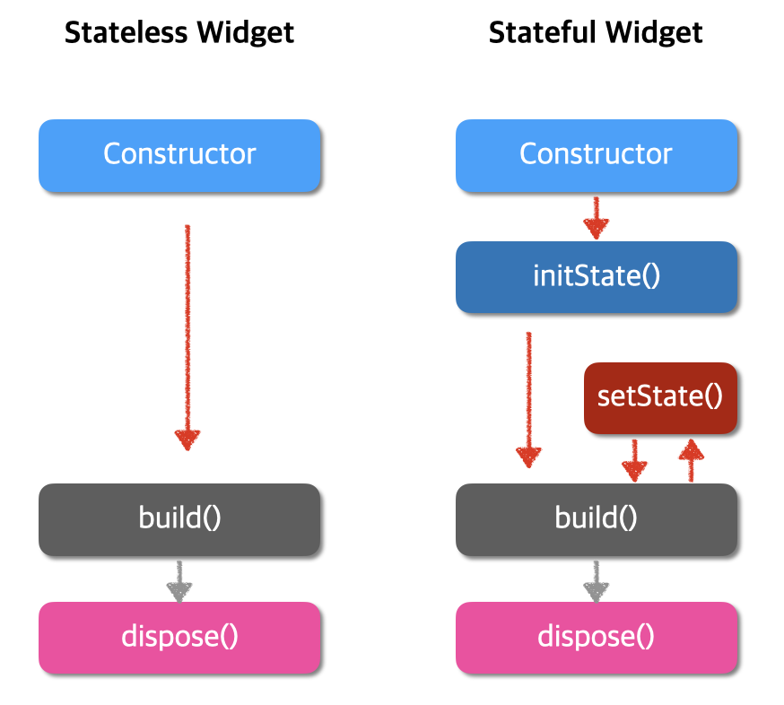

# 플러터 위젯

## 0 위젯이란?
화면에 보여지는 모든 객체(컴포넌트)를 의미  
상태가 계속해서 변해야 하는 것 : **Stateful Widget**
상태가 변하지 않는 것(고정 값) : **Stateless Widget**

## 1 Stateless Widget
객체의 상태변화가 불필요할 경우, 변수의 상수활용법인 **const** or **final** 과 같이  
Stateless Widget 을 구성하여 활용, 상태변화에 대한 고려가 없기 때문에  
**성능 면에서 우세**

## 2 Stateful Widget
객체의 상태변화가 필요할 경우, 일반 변수 활용법 (ex: dynamic, var, int ...) 과 같이  
Stateful Widget을 구성하여 활용, 사용된 변수가 수정될 경우 관련된 위젯의 모양 등을 수정  
**퍼포먼스 면에서 우세**

## 3 Widget LifeCycle
모든 위젯은 상속받은 위젯의 타입에 따라  
아래의 생명주기를 따름  
**setState()** 함수를 통해 값이 변할 경우, 해당 위젯만 rebuild 구조를 가짐

## 4 Widget Tree
위젯들은 **child** or **children** 이라는 속성 값을 가지고 있음  
해당 속성들을 통해 위젯들은 자기 안에 위젯을 포함할 수 있는 구조를 갖춤  
위젯 간의 상하 관계를 가질 수 있음을 의미  
일종의 부모 자식의 표현 방법으로 표시할 수 있음  
트리형태로 표현할 수 있음  
